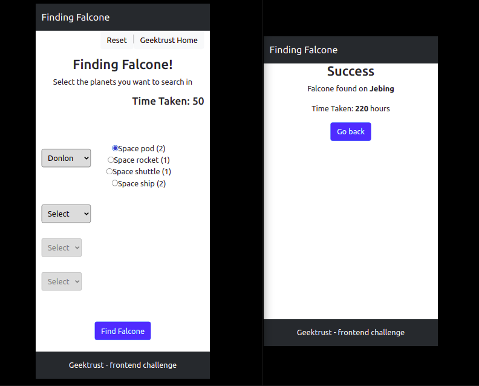
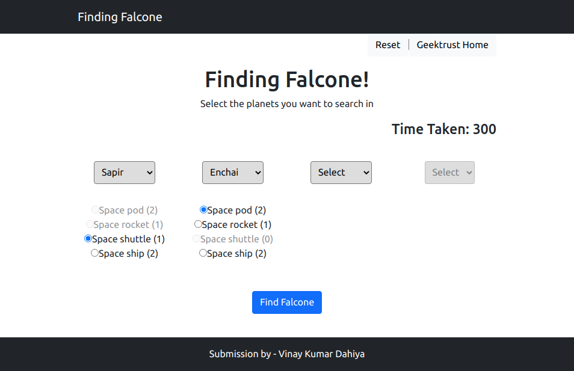

# Finding Falcone

## UI and solution for this [Geektrust coding challenge](https://www.geektrust.in/coding-problem/frontend/space)

## Problem statement

You need to build a UI through which King Shan can

- select 4 planets to search (out of the total 6)
- select which space vehicles to send to these planets
- see how much time it will take for the vehicles to reach their targets &
- show final result of success or failure

Given the API endpoints for [Planets](https://findfalcone.herokuapp.com/planets), [Vehicles](https://findfalcone.herokuapp.com), [Token](https://findfalcone.herokuapp.com/token), and to find the final [result](https://findfalcone.herokuapp.com/find), build the UI to acheive the tasks.

## Links

- [Github](https://github.com/winay05/Finding-Falcone)
- [Live](https://finding-falcone-vinay.netlify.app/)

## Built using:

- React.js - _UI_
- Bootstrap and React-boostrap - _Styling_
- inbuilt JS Fetch API - _API calls_

## Most Challenging part for me:

- Layering the components for interaction and managing the state.

 

## What works:

- Layout(as per requirements)- mobile friendly
- API calls
- Success page
- Can go back to change some prev destination
- Disabling vehicles on distance exceeding max_distance or on zero left

  ### what doesn't work:

  - unselecting radio button on prop change works funny.

 

      
This project was bootstrapped with [Create React App](https://github.com/facebook/create-react-app).
 
### Available Scripts

In the project directory, you can run:

### `npm start`

Runs the app in the development mode.\
Open [http://localhost:3000](http://localhost:3000) to view it in the browser.

The page will reload if you make edits.\
You will also see any lint errors in the console.

### `npm run build`

Builds the app for production to the `build` folder.\
It correctly bundles React in production mode and optimizes the build for the best performance.
